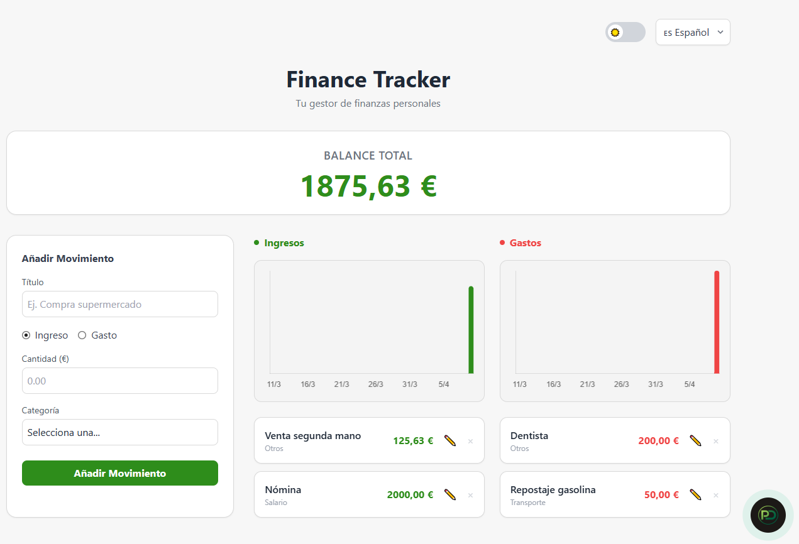
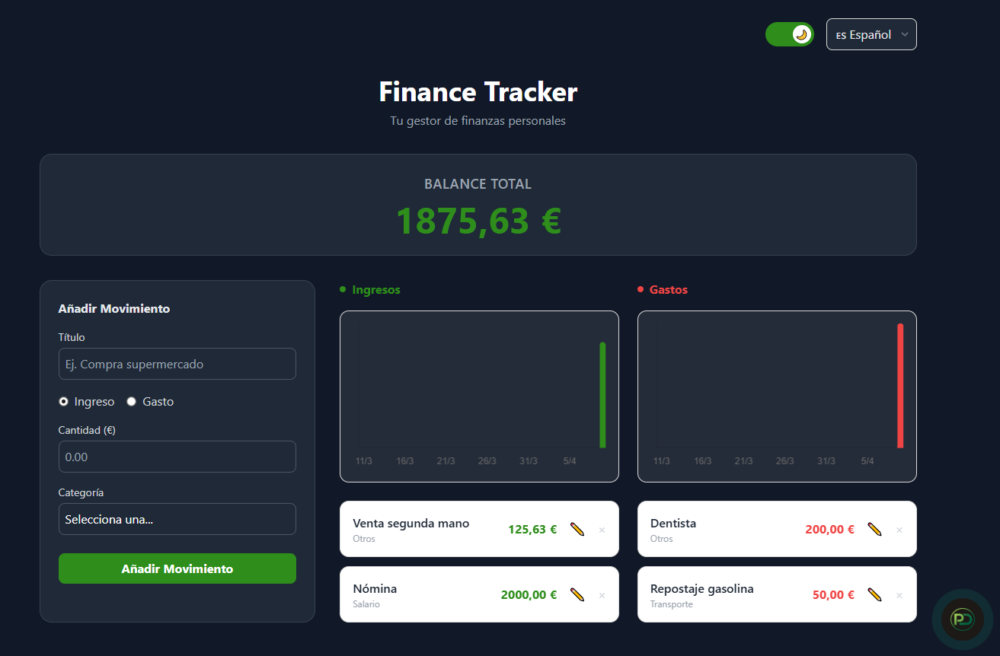
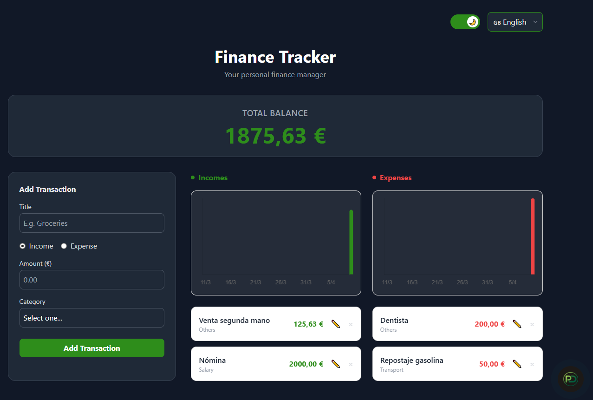

# Finance Tracker - Personal Finance Manager


Finance Tracker is a responsive, client-side personal finance tracking application built to demonstrate modern Frontend development skills. It allows users to track their incomes and expenses, visualize their data over the last 30 days, and maintain state persistence locally.

## Screenshots




🌍 **Live Demo:** [(https://finanzas-app-dusky.vercel.app)]

## Features

- **Full CRUD Operations:** Add, edit, and delete income and expense transactions.
- **Data Visualization:** Reusable Chart.js components to display 30-day financial trends.
- **State Persistence:** Data is automatically saved to the browser's `localStorage` using Pinia plugins.
- **Internationalization (i18n):** Full English and Spanish support.
- **Dark Mode:** System-aware and manually togglable dark theme using Tailwind CSS.
- **Responsive Design:** Fully optimized for Desktop, Tablet, and Mobile views.

## Tech Stack

- **Framework:** Vue 3 (Composition API & `<script setup>`)
- **Build Tool:** Vite
- **State Management:** Pinia (with `pinia-plugin-persistedstate`)
- **Styling:** Tailwind CSS
- **Charts:** Chart.js & vue-chartjs
- **i18n:** vue-i18n

## Architectural Decisions

- **Smart vs. Dumb Components:** Separated logic-heavy components (like the Form) from presentational components (like the Charts, using props).
- **Computed Caching:** Used Pinia getters (computed properties) to calculate totals and filter lists without unnecessary re-renders.
- **Watchers:** Utilized Vue watch to seamlessly populate the form when the user enters "Edit Mode".

## Local Setup

To run this project locally, follow these steps:

1. Clone the repository:
   ```bash
   git clone [https://github.com/PedroDelgado4/finanzas-app.git](https://github.com/PedroDelgado4/finanzas-app.git)
   ```
1. Navigate into the directory:
   ```bash
   cd finanzas-app
   ```
1. Install dependencies:
   ```bash
   npm install
   ```
4. Start the development server:
   ```bash
   npm run dev
   ```


